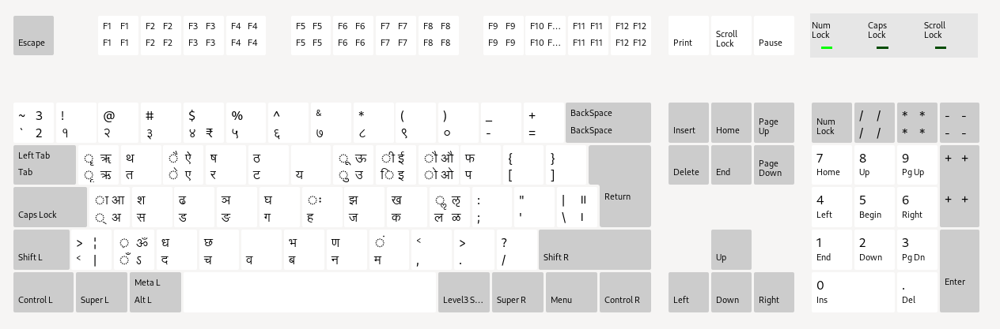
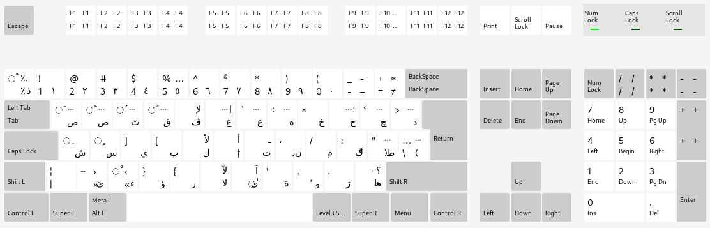
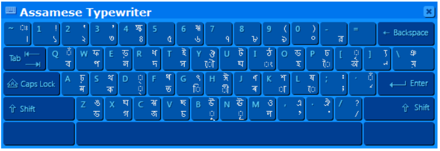
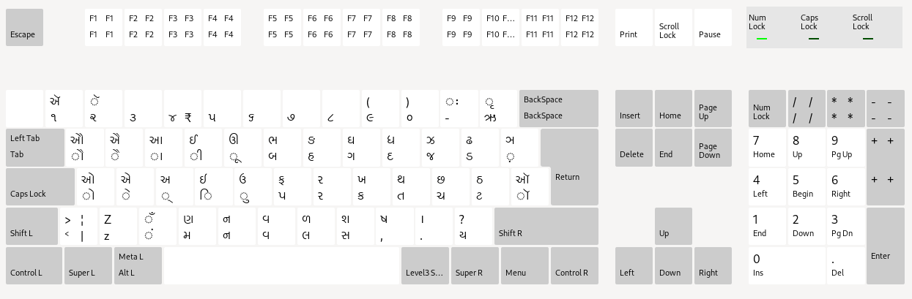
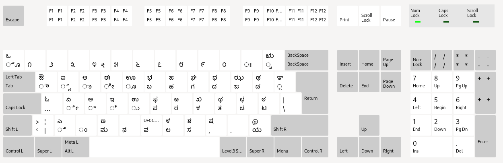
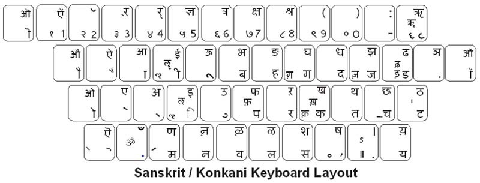
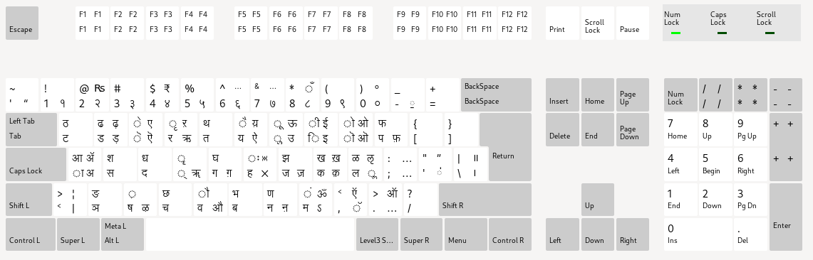
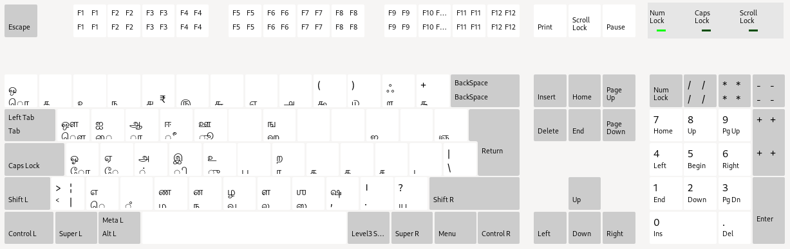
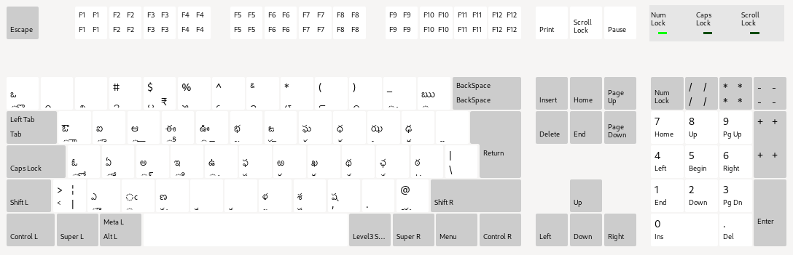
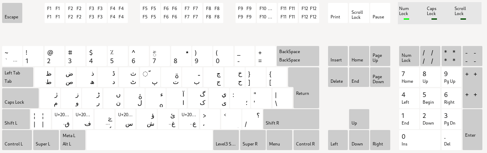

# keyboard-layouts
Layouts of different language keyboards, a helpful resource for translators.

# Changing the default language
 
This is usually managed by your operating system, here are some useful resources:
 
## Windows 10

- [A comprehensive guide by Microsoft](https://support.microsoft.com/en-us/windows/manage-the-input-and-display-language-settings-in-windows-10-12a10cb4-8626-9b77-0ccb-5013e0c7c7a2).  
- [A good article by Windows Central](https://www.windowscentral.com/how-properly-change-system-default-language-windows-10).  
- [A good article by How-to-Geek](https://www.howtogeek.com/232659/how-to-change-the-display-language-in-windows-10/).

## MacOS

- [A guide by Apple](https://support.apple.com/en-in/guide/mac-help/mchlp1406/mac).

## GNU/Linux

- [A comprehensive guide for KDE users](https://userbase.kde.org/Tutorials/Change_Plasma_Language).  
- [A handy guide for GNOME users](https://help.gnome.org/users/gnome-help/stable/session-language.html.en). Another [useful tip](https://help.gnome.org/users/gnome-help/stable/keyboard-layouts.html.en) for GNOME users.

# Keyboard layouts for different languages

## Hindi (IN)

## Arabic (QWERTY)

## Assamese

## Bangla (IN)

## Gujarati

## Kannada

## Konkani

## Malayalam

## Marathi

## Tamil

## Telugu

## Urdu

